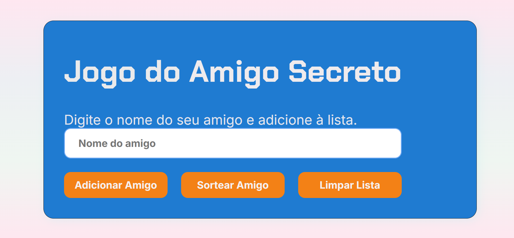

# Projeto Amigo Secreto

Projeto desenvolvido como parte do programa **ONE (Oracle Next Education)**, oferecido pela plataforma **Alura** em parceria com a **Oracle**. O projeto aplica conceitos práticos de desenvolvimento web com **HTML**, **CSS** e **JavaScript**, integrando aprendizado teórico e prático.

## Descrição

Jogo interativo de Amigo Secreto que permite cadastrar participantes, realizar sorteios aleatórios sem repetição e acompanhar a lista em tempo real. Ideal para confraternizações e eventos.

## Tecnologias Utilizadas

- HTML5
- CSS3
- JavaScript

## Funcionalidades

- Cadastro de participantes com validação para evitar nomes duplicados e campos vazios.
- Lista dinâmica de participantes.
- Sorteio aleatório e exclusivo de amigos secretos.
- Remoção automática dos nomes sorteados.
- Sorteios contínuos até que a lista esteja vazia.

## Como usar

1. Digite o nome do participante no campo.
2. Clique em **Adicionar Amigo** ou pressione **Enter** para inserir.
3. Clique em **Sortear Amigo** para revelar o amigo secreto.
4. O nome sorteado aparece na tela e é removido da lista.
5. Repita até sortear todos.

## Demonstração

  

## Acesso

O projeto está disponível online em: 
https://github.com/jlinhareshofsetz/jogo-amigo-secreto

## Sobre a Desenvolvedora

**Jéssica Linhares Hofsetz**  
Participante do programa **ONE (Oracle Next Education)** pela plataforma Alura.

